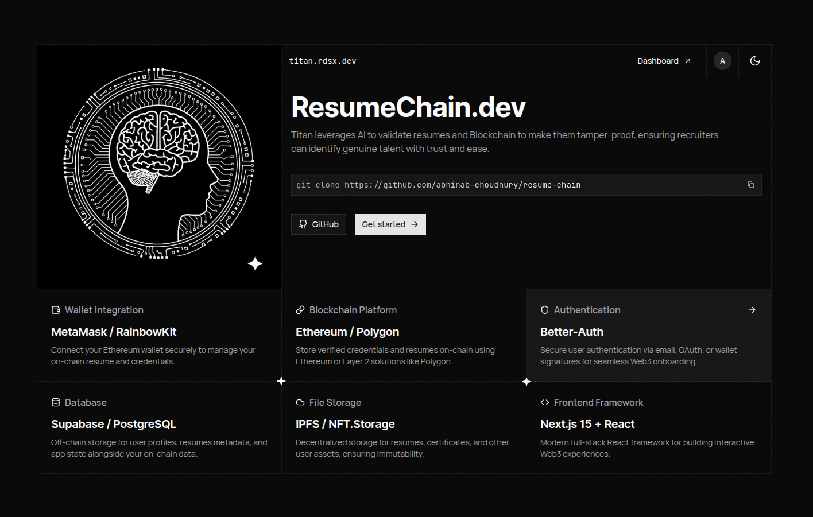

# ResumeChain.dev
> Template: [rudrodip/titan](https://github.com/rudrodip/titan)  
Next.js 15 fullstack template with better-auth for authentication and drizzle-orm as the ORM.

## **ProofChain Resumes – Verifiable, Intelligent, and Versioned Resumes**

### 🔍 Problem

Traditional resumes are static, easily faked, and lack credibility. Recruiters struggle with trust, version history, and real validation of candidates’ claims.

---

### 💡 Our Solution

**ProofChain Resumes** is a decentralized, intelligent resume platform that lets professionals upload, update, and verify their resumes on the blockchain. Recruiters get complete transparency into the **authenticity, history, and proof of skills**.

---

### ✨ Key Features

#### 📝 **Resume Upload & Versioning**

* Upload resumes (PDF/DOC).
* Each new upload automatically becomes a new **version** (v1, v2, v3…).
* Recruiters can view **entire history** of resume changes over time.

#### 📦 **IPFS Storage**

* Every resume is securely stored on **IPFS**.
* Generates a **content-addressable hash (CID)** that guarantees file integrity.

#### 🔗 **On-Chain Proofs (Mint Proof)**

* Users can **mint a proof** of their resume version on-chain.
* Proof includes:

  * Resume version
  * IPFS hash
  * Timestamp
  * Verification method
* Recruiters can instantly check validity on the blockchain via a **Proof Page**.

#### 📊 **AI-Powered Resume Insights (Wolfram Integration)**

* Resumes are **analyzed with Wolfram API**.
* Generates an **intelligence score** (how strong the resume is).
* Provides structured **insights on skills, experience, and domain knowledge**.
* Turns static resumes into **actionable insights** for recruiters.

#### 👔 **Recruiter / Verification Dashboard**

* Recruiters can:

  * View latest + older resume versions.
  * Verify **on-chain proofs** with a single click.
  * See AI-driven resume insights & scoring.
* Builds **trust and transparency** into hiring.

#### 🔐 **Authentication & Protected Routes**

* Secure login system for users & recruiters.
* Proof pages are **shareable** but cannot be tampered with.

---

### 🖼 Example Flow

1. **Candidate uploads Resume v1 → Stored on IPFS.**
2. Candidate **updates Resume → v2 created** (history maintained).
3. Candidate **mints proof** of v2 → On-chain validation.
4. Recruiter opens **Proof Page** → Sees resume, proof hash, transaction link, AI insights.
5. Recruiter can also check **v1 vs v2** to track candidate’s evolution.

---

### ⚡️ Why It’s Unique

* **Blockchain + AI combo**: Proof of authenticity + intelligent scoring.
* **Versioning**: Recruiters see a candidate’s growth, not just the latest snapshot.
* **Trustless Verification**: No third party required, resumes are self-verifiable.
* **Judge-Friendly**: The "Mint Proof" button → instant demo of blockchain validation.
---

# ⚔️ Challenges I Faced

* **Versioning Complexity** – Designing a clean way to manage multiple versions of a resume (v1, v2, v3…) while ensuring that recruiters can still trace back and verify older versions without confusion.
* **Blockchain Proof Flow** – Integrating “Mint Proof” on-chain in a judge-friendly way while keeping the UX smooth and avoiding overwhelming technical details.
* **IPFS Integration** – Handling resume uploads to IPFS, ensuring the CIDs stay consistent across versions, and syncing them properly with the blockchain proof.
* **AI Insights (Wolfram)** – Converting raw resume data into meaningful scores and insights that recruiters can actually use, rather than just generating generic outputs.
* **Balancing Security & Usability** – Allowing easy resume sharing while keeping the proof page verifiable, tamper-proof, and recruiter-friendly.
* **Hackathon Time Crunch** – Stitching together Web3, IPFS, and AI while also designing a clean **Next.js UI** that judges can understand in under a minute.
